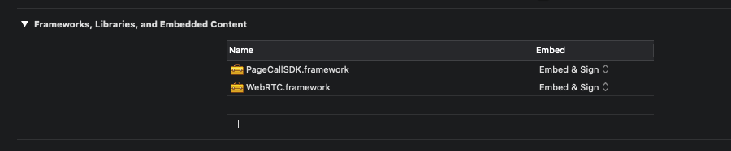

# PageCall iOS SDK

Pagecall iOS SDK를 이용하면 여러분의 iOS 어플리케이션에 쉽게 PageCall을 적용할 수 있습니다. 

아래 문서를 통해 PageCall의 iOS Software 개발에 필요한 환경과 상세 설치 과정을 이해할 수 있으니 숙지하기 바랍니다.

## 요구사항(pre-requisites)

- Xcode ≥ 11.1
- iOS ≥ 11
- swift-version ≥ 4.2

## PageCall SDK 설치

- `[PageCallSDK.framework](https://github.com/pplink/pagecall-ios-example/tree/master/sample-swift)`, `[WebRTC.framework](https://github.com/pplink/pagecall-ios-example/tree/master/sample-swift)` 파일을 다운받아 적용하고자 하는 프로젝트위치로 복사
- General -> Frameworks, Libraries, and Embedded Content -> + 버튼 -> `PageCallSDK.framework`, `WebRTC.framework` 두 개의 framework를 iOS 프로젝트에 추가

    

- Embed 옵션은 `Embed & Sign` 으로 설정
- Build Settings -> Build Options -> `Enable Bitcode = No` 로 설정
- Build Settings -> Swift Compiler -> Import Paths  + `$(SRCROOT)/PageCallSDK.framework/Headers` 추가

## 개인정보 허용에 대한 설명 추가

iOS 프로젝트의 info.plist에 아래와 같이 개인정보 허용에 대한 설명을 추가 한다.

    <key>NSCameraUsageDescription</key>
    <string>Blink uses your camera to make video calls.</string>
    <key>NSContactsUsageDescription</key>
    <string>Blink needs access to your contacts in order to be able to call them.</string>
    <key>NSMicrophoneUsageDescription</key>
    <string>Blink uses your microphone to make calls.</string>
    <key>NSPhotoLibraryAddUsageDescription</key>
    <string>Our application needs permission to write photos...</string

## 예제

### PageCallSDK 추가

    // Swift
    import PageCallSDK

    // Objective-C
    #import <PageCallSDK/PageCallSDK.h>

### PageCall 실행

    // Swift
    let pageCall = PageCall.sharedInstance()
    pageCall.delegate = self
    pageCall.call(withMyId: self.myId.text!, roomId: self.roomId.text!, pcaURL: self.serverURL.text!)
    
    pageCall.pcViewController?.modalPresentationStyle = .overFullScreen
    self.present(pageCall.pcViewController!, animated: true, completion: nil)

    // Objective-C
    PageCall *pageCall = [PageCall sharedInstance];
    [pageCall setDelegate:self];
    [pageCall callWithMyId:self.myId.text roomId:self.roomId.text pcaURL:self.serverURL.text];
    
    pageCall.pcViewController.modalPresentationStyle = UIModalPresentationOverFullScreen;
    [self presentViewController:pageCall.pcViewController animated:YES completion:nil];

### PageCall 종료

PageCallDelegate를 통해 PageCall 종료 이벤트를 받을 수 있다.

    // Swift
    extension ViewController: PageCallDelegate {
        func pageCallDidClose() {
            print("pageCallDidClose")
        }
    }

    // Objective-C
    @interface ViewController ()<PageCallDelegate>
    
    ...
    
    - (void)pageCallDidClose {
        NSLog(@"pageCallDidClose");
    }

### PageCall 로그 파일

PageCall 로그 기능을 사용하면 PageCall 사용 시 기록한 로그를 App의 `Documents` 에 로그 파일을 자동으로 저장한다.

    // Swift
    pageCall.enableLog()

    // Objective-C
    [pageCall enablePageCallLog];